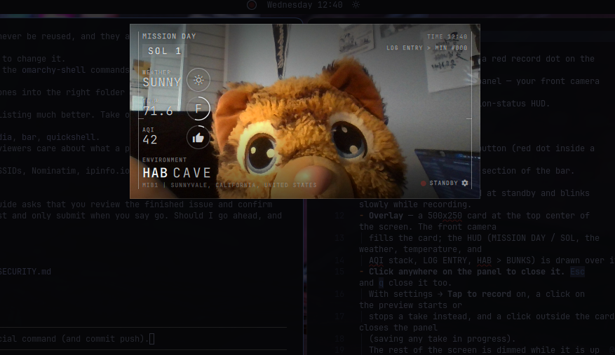

# MIB Vlog



An Omarchy shell plugin: a red record dot on the status bar that opens a
Mars-mission style vlog panel — your front camera live in the background,
under a translucent mission-status HUD.

## What it does today

- **Bar widget** — a record button (red dot inside a ring), placeable in the
  `left`, `center`, or `right` section of the bar. Clicking it toggles the
  panel. The dot is faded at standby and blinks slowly while recording.
- **Overlay** — a 500x250 card at the top center of the screen. The front camera
  fills the card; the HUD (MISSION DAY / SOL, the weather, temperature, and
  AQI stack, LOG ENTRY, HAB > BUNKS) is drawn over it.
- **Click anywhere on the panel to close it.** `Esc` and `q` close it too.
  With settings → **Tap to record** on, a click on the preview starts or
  stops a take instead, and a click outside the card closes the panel
  (saving any take in progress).
  The rest of the screen is dimmed while it is up (settings → **Dim
  background**, on by default).
- **Settings** — the gear beside STANDBY swaps the card over to its own
  settings face. `Esc` or the gear again returns to the feed.

The camera is only active while the panel is open, so closing it releases
`/dev/video*` and drops the webcam light.

## What the HUD shows

| Reading | Where it comes from |
|---|---|
| MISSION DAY, SOL, HAB, BUNKS, LOG ENTRY > WATNEY, TIME | editable labels, defaulting to the strings above |
| `WEATHER` | current conditions (SUNNY, RAIN, OVERCAST, ...) at the configured location, with a matching icon in the circle; refreshed on open and every 15 minutes |
| `TEMP` | current air temperature in °C or °F (a settings choice, °C by default), with the scale letter in the circle and its outline lit clockwise as a gauge: -10..50 °C, 0..130 °F. Updates with each weather fetch |
| `AQI` | current US air quality index (0-500) from Open-Meteo, with a thumbs-up at 100 or under (good/moderate) and thumbs-down above; the circle is a 0-500 gauge. Updates with each weather fetch |
| `SOL n` | whole days since the launch date, 0-based — launch day is sol 0 |
| `TIME hh:mm` | the current time, 24-hour |
| `host \| location` | this machine's hostname and the weather location |
| `WATNEY #000` | the log index: takes saved so far this sol, starting over at 000 each new sol |

### Location

The first open guesses where you are: nearby Wi-Fi access points (BSSIDs and
signal strength only — never network names, and networks named `*_nomap` are
skipped) go to [BeaconDB](https://beacondb.net), which falls back to IP
geolocation; if that fails, ipinfo.io's IP lookup. The coordinates are named
via OpenStreetMap's Nominatim. See `locate.sh`.

The settings face's LOCATION box is a search: type part of a city and pick a
match (arrow keys + Enter, or click). Empty the box and press Enter to guess
again. Weather and city search come from [Open-Meteo](https://open-meteo.com),
which needs no API key.

Settings live in `~/.config/mib-vlog/settings.json`, which is written on the
first open — the launch date defaults to that day, so a fresh install starts
at sol 0. Editing the file by hand works too; the panel reloads on change.

To open straight onto the settings face:

```bash
omarchy-shell shell summon io.github.mindows.mib-vlog '{"settings":true}'
```

## Recording

Click **STANDBY** (or its dot) — or, with **Tap to record** on, anywhere on
the preview — to start a take: the label becomes
**RECORDING** and the dot blinks. Click again to stop — or just close the
panel, which stops and saves the take too.

Takes are saved to a folder per month under the output folder (default
`~/mib-vlogs`, created on demand; change it in settings) as
`YYYYMM/YYYYMMDD-<sol>-<seq>.mp4`, e.g. `~/mib-vlogs/202609/20260922-0-000.mp4`
(its transcript, if on, beside it as `.md`), where `<seq>` is the log index on the feed. If the name
is taken, `-1`, `-2`, ... is appended.

- Video is the panel's 2:1 frame (1280x640: the camera with its top cut off
  to fit, as on screen) with the HUD burned in — everything but the record marker and the
  gear. The clock in the video turns over exactly on each minute.
- The picture is saved mirrored, as the preview shows it (settings →
  **Mirror video**, on by default). Only the camera is flipped; the HUD is
  laid on afterwards and reads normally. Turn it off for the camera's true
  view, in which text in the scene reads correctly.
- Sound is the system's default microphone as of the moment the take
  starts, so switching mics takes effect on the next take.
- The HUD is burned in at save time, not while recording: an off-screen
  copy of it at the video's size is snapshotted as the take starts and at
  each minute change, and `finalize.sh` overlays each snapshot from its
  offset during the re-encode it does anyway. This adds about 0.1 s of
  processing per second of footage, after the take stops.
- Picture and sound are recorded separately — Qt for video, PipeWire's
  `pw-record` for audio — because inside the long-running shell Qt keeps
  recording whichever mic was the default when the panel first loaded. They
  are stopped together and lined up by their ends.
- A take is written to hidden `.<name>.recording.mp4` / `.wav` files and
  becomes the real file only once both have closed. `finalize.sh` then joins
  them and re-encodes to 8-bit 4:2:0 H.264 with `ffmpeg`, because Qt's
  recorder writes 10-bit 4:4:4, which browsers, phones, and QuickTime cannot
  play. A notification says when the file is saved.
- The microphone is opened only during a take.

### Transcript

Off by default (settings → **Transcribe**). When on, after the video is
saved its sound is transcribed with **voxtype** (Omarchy's
local Whisper, using the model voxtype is configured for) into a Markdown
file beside it — `20260922-0-013.md` next to `20260922-0-013.mp4`: the video
embedded at the top (`![[20260922-0-013.mp4]]`, which Obsidian plays inline),
a heading with the log entry, a line with the start time, sol, place, and
length, the text (or _No speech detected._), and an **Environment** section
at the end with the weather, temp, and AQI at the start of the take. It runs after the file is saved and
the notification is sent, and needs `voxtype` installed; without it there is
no transcript.

### Metadata

Each file carries the take's details, as they stood when it started:

| Tag | Example |
|---|---|
| `title` | `LOG ENTRY > WATNEY #013` |
| `comment` | `SOL 0 \| Houston, Texas, United States \| Clear 84.2 °F \| AQI 46` |
| `creation_time` | start, UTC, whole seconds |
| `com.apple.quicktime.creationdate` | start, local time with offset |
| `com.apple.quicktime.location.ISO6709` | `+29.7604-95.3698/` |
| `mibvlog.start`, `mibvlog.duration`, `mibvlog.duration_seconds` | `2026-09-22T21:45:44-07:00`, `00:00:04`, `4.124` |
| `mibvlog.location`, `mibvlog.latitude`, `mibvlog.longitude` | place name and coordinates |
| `mibvlog.hostname`, `mibvlog.weather`, `mibvlog.temperature`, `mibvlog.aqi` | `my-laptop`, `Clear`, `84.2 °F`, `46` |
| `mibvlog.sol`, `mibvlog.log_entry` | `0`, `013` |

The creation date and ISO 6709 location are the keys photo libraries read.
See them all with `ffprobe -show_entries format_tags <file>`. (ffprobe
lists `creation_time` twice — the MP4 header keeps its own copy — and both
name the same second.)

The place name, its coordinates (the ISO 6709 tag and
`mibvlog.latitude/longitude`), and the hostname are only written with
settings → **Location metadata** on; it is off by default, so a shared file
does not say where it was made. When the location came from the first-run
Wi-Fi guess, the coordinates can be close to where you are — pick a city
with the settings search if you turn this on. The HUD burned into the
picture still shows `host | location` either way, and the transcript keeps
the place. To strip the tags from a file afterwards:
`ffmpeg -i in.mp4 -map_metadata -1 -c copy out.mp4`.

### Noise reduction

On by default (settings → **Noise reduction**). When a take is saved, its
sound is cleaned of steady background noise such as the hiss and rumble of a
laptop fan beside a built-in mic: a high-pass below 90 Hz, then ffmpeg's
FFT denoiser (`afftdn`) tracking the noise floor. On a fan-noisy take it
lowers the noise in pauses by about 12 dB and leaves the voice intact. It
does little for changing noise (typing, voices); a system-wide RNNoise
filter (e.g. EasyEffects) handles that better.

### If the sound is distorted

Check the microphone's input gain before anything else. A capture chain
turned all the way up clips ordinary room sound into harsh, buzzing noise
that no player or encoder can undo. For a built-in laptop mic, e.g.:

```bash
amixer -c 0 sget 'Internal Mic Boost'   # 3 = +30 dB, often far too hot
amixer -c 0 sset 'Internal Mic Boost' 0
```

Start or stop a take from a script or keybinding while the panel is open:

```bash
omarchy-shell shell call io.github.mindows.mib-vlog toggleRecording ""
```

## Install

```bash
omarchy plugin add https://github.com/mindows/mib-vlog.git --enable
```

This clones the plugin into `~/.config/omarchy/plugins/io.github.mindows.mib-vlog/` and adds the
widget to the bar's right section (it asks which section in a terminal).
Leave off `--enable` to read the code before turning it on with
`omarchy plugin enable io.github.mindows.mib-vlog`.

Move the widget with:

```bash
omarchy bar move io.github.mindows.mib-vlog --section left     # or center, right
```

Toggle the panel without the bar:

```bash
omarchy-shell shell toggle io.github.mindows.mib-vlog
```

Update it with `omarchy plugin update io.github.mindows.mib-vlog`, which shows the changes before
applying them.

## Remove

```bash
omarchy plugin remove io.github.mindows.mib-vlog
```

This removes the plugin and its bar entry. `omarchy plugin disable io.github.mindows.mib-vlog`
turns it off but keeps it installed. Your settings
(`~/.config/mib-vlog/`) and recordings (`~/mib-vlogs/` by default) are left
in place; delete them yourself if you no longer want them.

## Requirements

- Omarchy shell (Quickshell) with plugin schema version 1
- `qt6-multimedia` and a camera at `/dev/video*`
- `curl` and `jq`; `nmcli` for the Wi-Fi part of the location guess
- `ffmpeg` to join and re-encode takes (without it the picture is kept as
  recorded, without sound)
- `pw-record` and `pactl` (PipeWire) for the sound
- `voxtype` for transcripts (optional)

## Layout

| File | What it is |
|---|---|
| `manifest.json` | plugin id, kinds (`bar-widget`, `overlay`), entry points |
| `BarWidget.qml` | the record dot; toggles the overlay |
| `Overlay.qml` | the panel: camera card, settings face, and the off-screen HUD copy |
| `Hud.qml` | the HUD itself, laid out from its own width |
| `SettingsStore.qml` | the settings file, the clock, sol, and the hostname |
| `SettingsView.qml` | the settings face of the card |
| `Weather.qml` | current conditions, the first-run location guess, and city search |
| `WeatherCodes.js` | WMO weather codes → HUD word and icon |
| `Plugin.js` | the plugin's folder on disk and the record red |
| `locate.sh` | Wi-Fi / IP location guess |
| `fetch.sh` | every network request: curl with a deadline and a 64 KiB ceiling on the answer |
| `Recording.qml` | takes: start/stop, file naming, hand-off to finalize |
| `prepare.sh` | creates the output folder and picks a free file name |
| `finalize.sh` | joins a take's picture and sound, re-encodes, and moves it to its final name |

## Contributing

Bug reports, ideas, and pull requests are welcome — see
[CONTRIBUTING.md](CONTRIBUTING.md).

## License

[MIT](LICENSE)
